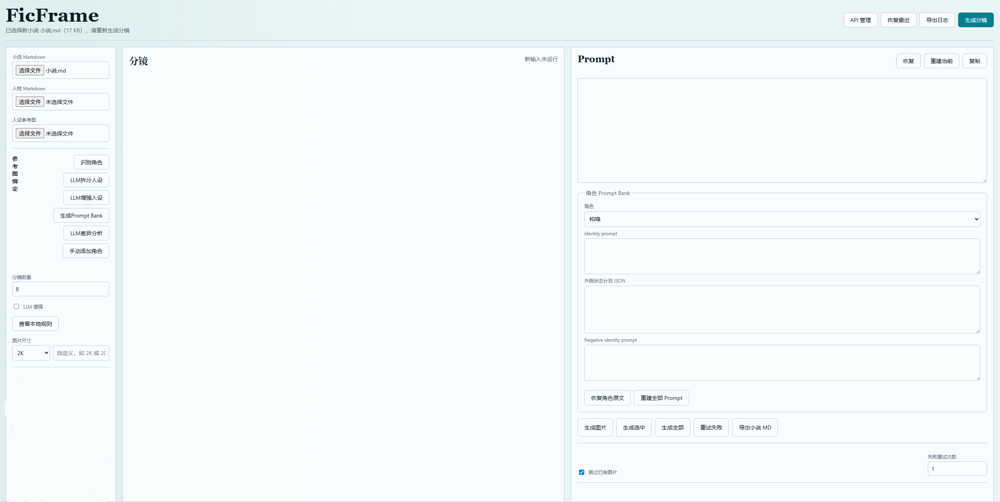

# FicFrame

FicFrame 是一套本地运行的小说配图工作台，用来把小说正文、人物设定和角色参考图组织成可迭代的分镜与生图流程。它的重点不是一次性生成几张图，而是帮助创作者在长篇文本里维护角色一致性、剧情连续性、参考图绑定、Prompt 编辑和图片版本选择。

适合这些场景：

- 给二创小说、原创小说或跑团记录生成插图分镜
- 把长篇章节切成适合生图的画面段落
- 从人物 Markdown 中提取角色卡、外貌、关系和固定设定
- 为角色生成可复用的 identity prompt 和外貌状态计划
- 用参考图约束角色长相，并在 Web 里绑定“角色 -> 多张参考图”
- 使用 LLM / VLM / 图片模型分别增强人设、分析参考图、生成图片
- 批量生成、失败重试、断点续跑，并保留图片历史版本
- 导出已经插入配图的完整小说 Markdown
- 一键导出脱敏日志包，方便反馈问题

## 功能概览

- 本地规则：不开 API key 也能切分章节、识别角色、生成基础分镜和 Prompt。
- LLM 辅助：可独立触发人设拆分、人设增强、Prompt Bank、角色差异分析和场景理解。
- VLM 辅助：只用于提取参考图中的稳定视觉事实，例如发型、服装轮廓、标志物。
- 图片生成：支持 OpenAI 兼容接口、火山 Ark、SiliconFlow、Grsai 等常见接口形态。
- API 管理：Web 里维护多套 LLM / VLM / 图片供应商，每个供应商有自己的地址、Key 和模型昵称。
- 参考图绑定：上传多张参考图后，在表格里绑定到不同角色。
- Prompt 编辑：分镜 Prompt、角色 identity prompt、外貌状态计划都可以在 Web 里修改并保留。
- 部分重生成：可勾选任意分镜生成图片，不必只生成当前一张或全部。
- 图片版本：重新生成不会覆盖旧图，新图先作为候选版本保存，可手动设为当前图。
- 导出：导出包含配图的完整小说 Markdown，图片路径相对于导出文件所在目录。
- 日志：Web 顶部可导出日志包，便于提交 issue 时定位问题。

## 预览

如果仓库中存在预览图，可在这里查看：



## 快速开始

### Windows 用户

双击项目根目录下的：

```text
start.bat
```

脚本会自动完成：

- 进入项目目录
- 优先使用 `uv` 管理环境
- 如果没有 `uv`，自动改用 Python `venv + pip`
- 使用清华 PyPI 镜像安装依赖
- 如果没有 `.env`，从 `.env.example` 复制一份
- 启动 Web 服务并打开浏览器

默认访问地址：

```text
http://127.0.0.1:8787
```

### PowerShell

```powershell
.\start.ps1
```

指定端口：

```powershell
.\start.ps1 -Port 8788
```

### macOS / Linux

```bash
chmod +x ./start.sh
./start.sh
```

指定端口：

```bash
FICFRAME_PORT=8788 ./start.sh
```

### 手动启动

使用 `uv`：

```powershell
$env:UV_CACHE_DIR=".uv-cache"
uv sync
uv run ficframe serve --host 127.0.0.1 --port 8787
```

不使用 `uv`：

```powershell
python -m venv .venv
.\.venv\Scripts\python.exe -m pip install -U pip -i https://pypi.tuna.tsinghua.edu.cn/simple
.\.venv\Scripts\python.exe -m pip install -r requirements.txt -i https://pypi.tuna.tsinghua.edu.cn/simple
.\.venv\Scripts\python.exe -m ficframe.cli serve --host 127.0.0.1 --port 8787
```

`pyproject.toml` 已为 `uv` 配置清华源：

```toml
[[tool.uv.index]]
name = "tuna"
url = "https://pypi.tuna.tsinghua.edu.cn/simple"
default = true
```

## Web 使用流程

1. 打开 `http://127.0.0.1:8787`。
2. 点击顶部 `API 管理`，分别配置 LLM、VLM 和图片供应商。
3. 上传小说 Markdown / TXT。
4. 上传人物 Markdown / TXT。
5. 可选：上传角色参考图。
6. 在 `参考图绑定` 表里确认每张图对应的角色。
7. 点击 `识别角色` 使用本地规则，或点击 `LLM拆分人设` 让 LLM 辅助解析。
8. 可选：点击 `LLM增强人设`、`生成Prompt Bank`、`LLM差异分析`。
9. 设置分镜数量和图片尺寸。
10. 点击 `生成分镜`。
11. 检查每个分镜的 Prompt，可按需修改。
12. 点击 `生成图片`、`生成选中`、`生成全部` 或 `重试失败`。
13. 在图片版本列表里选择最满意的一张设为当前图。
14. 点击 `导出小说 MD`，得到插入配图后的完整小说 Markdown。
15. 遇到问题时点击 `导出日志`，把 zip 日志包附到 issue。

输出目录：

```text
outputs/web-runs/<run_id>/
├── pipeline.json
├── storyboard.md
├── prompts.md
├── continuity.json
├── illustrated_novel.md
├── images/
└── references/
```

导出的小说 Markdown 会保存在：

```text
outputs/web-runs/<run_id>/illustrated_novel.md
```

图片保存在：

```text
outputs/web-runs/<run_id>/images/
```

## API 供应商配置

FicFrame 把 LLM、VLM 和图片模型分开配置。三类 API 可以使用完全不同的：

- 请求地址
- API key
- 模型
- 供应商类型
- 模型昵称

配置入口在 Web 顶部 `API 管理`。配置会保存到：

```text
.ficframe/providers.json
```

同时会同步写入 `.env`，便于命令行流程继续使用。`.env` 和 `.ficframe/` 默认不会提交到仓库。

### `.env` 示例

```env
FICFRAME_LLM_API_KEY=sk-your-llm-key
FICFRAME_LLM_BASE_URL=https://api.openai.com/v1
FICFRAME_LLM_MODEL=gpt-5-mini
FICFRAME_TIMEOUT=300

FICFRAME_VLM_API_KEY=sk-your-vlm-key
FICFRAME_VLM_BASE_URL=https://api.openai.com/v1
FICFRAME_VLM_PROVIDER=openai
FICFRAME_VLM_MODEL=gpt-5-mini

FICFRAME_IMAGE_API_KEY=sk-your-image-key
FICFRAME_IMAGE_BASE_URL=https://ark.cn-beijing.volces.com/api/v3
FICFRAME_IMAGE_PROVIDER=ark
FICFRAME_IMAGE_MODEL=doubao-seedream-5-0-260128
FICFRAME_IMAGE_TIMEOUT=900
```

没有配置 API key 时，Web 仍然可以生成本地分镜和基础 Prompt。只有 LLM 增强、VLM 参考图分析和图片生成需要对应的 API。

### 支持的图片供应商类型

| 类型 | 用途 | 说明 |
| --- | --- | --- |
| `openai` | OpenAI 兼容图片接口 | 适合兼容 `/images/generations` 或 `/images/edits` 的网关 |
| `ark` | 火山 Ark / 豆包图片接口 | 使用 `/images/generations`，支持 `size=2K` 等参数 |
| `siliconflow` | SiliconFlow 图片接口 | 使用 `image_size`、`num_inference_steps`、`guidance_scale` |
| `grsai` | Grsai 图片接口 | 参考图会作为 data URL 放入 `images` 字段 |

## 输入格式建议

Web 左侧有 `查看本地规则` 按钮。按这些规则整理输入，可以减少 LLM token 消耗，也能让不开 LLM 时的结果更稳定。

### 人物 Markdown

推荐写法：

```markdown
## 角色名

- 身份：主角 / 指挥官 / 研究员
- 别名：代号A / 昵称B
- 外貌：短发，白外套，红色眼睛
- 性格：冷静，行动派，说话直接
- 固定：发色不能变，始终带工具箱
- 道具：工具箱，数据板
- 关系：与另一角色是搭档


```

本地规则重点识别这些线索：

| 模块 | 推荐输入 |
| --- | --- |
| 角色开头 | `## 角色名`，或单独一行角色名加简介 |
| 人设字段 | 身份、外貌、性格、固定、禁止变化、道具、关系、别名、代号 |
| 参考图 | 文件名包含角色名，或在 Web 绑定表里手动选择 |

### 小说 Markdown

推荐写法：

```markdown
# 第一章

夜晚，研究室里只剩下一盏台灯。角色A合上工具箱，准备离开。

角色B站在门边，没有阻拦，只是轻声提醒她明天的任务。
```

本地分镜会优先识别：

- `# 第一章`、`第二章`、`Chapter 1` 等章节标题
- 自然段落
- 段落里的角色名或别名
- 地点、时间、情绪、动作和关键道具

## 分镜与 Prompt 流程

整体流程如下：

```text
小说正文
-> 章节 / 段落切分
-> 场景候选
-> 按章节均衡选择分镜
-> 结合角色卡、参考图、差异分析生成 Prompt
-> 可选 LLM 精修
-> Web 手动编辑
-> 图片生成
-> 图片版本选择
-> 导出配图小说 Markdown
```

角色 Prompt Bank 包含：

- `identity_prompt`：角色固定身份、外貌、体型、气质和参考图事实。
- `negative_identity_prompt`：防止角色漂移、同脸、错服装、错身份的负面约束。
- `appearance_states`：外貌状态计划，例如默认服装、受伤、换装、任务后疲惫等。

如果角色没有明确外貌变化，FicFrame 会复用同一份 `identity_prompt`，只替换当前分镜里的动作、表情、道具和场景。

## 图片版本历史

图片重新生成不会覆盖旧图。

- 第一次生成：自动设为当前图。
- 已有当前图时再次生成：保存为候选版本。
- 在 Web 的 `图片版本` 区域点击 `设为当前`，才会替换当前版本。
- 导出小说 Markdown 使用当前版本，而不是最新候选版本。

文件示例：

```text
images/shot_03.png
images/shot_03_1786123456789.png
images/shot_03_1786123499999.png
```

## 失败重试与断点续跑

- `跳过已有图片`：批量生成时跳过已经有当前图的分镜。
- `失败重试次数`：每张失败图片会按设置自动重试。
- `重试失败`：只对当前没有图片的分镜重新请求。
- `生成选中`：勾选任意多个分镜，只重生成这些分镜。
- `pipeline.json`：保存当前 run 的角色、场景、分镜、Prompt、图片版本等完整状态。
- 浏览器草稿：刷新页面后会尽量恢复当前分镜、Prompt 和图片状态。
- `恢复最近`：从 `outputs/web-runs/` 恢复最近一次 Web run。

## 日志与问题反馈

日志目录：

```text
outputs/logs/
```

主要文件：

| 文件 | 说明 |
| --- | --- |
| `ficframe.log` | 普通运行日志，请求状态、分镜流程、生图流程 |
| `errors.log` | 警告和异常日志 |
| `ficframe-logs-*.zip` | Web 导出的日志包 |

Web 顶部的 `导出日志` 会生成 zip，通常包含：

- 脱敏后的运行信息
- 最近日志
- 当前 run 的 `pipeline.json`、`storyboard.md`、`prompts.md`、`continuity.json`

公开反馈前，建议检查 zip 里是否包含你不想公开的小说正文、人设或 Prompt。更多说明见 [SECURITY.md](SECURITY.md)。

## 命令行用法

完整流程：

```powershell
uv run ficframe run --novel "examples/minimal/novel.md" --characters "examples/minimal/characters.md" --out "outputs/minimal-demo" --max-shots 3
```

启用 LLM：

```powershell
uv run ficframe run --novel "examples/minimal/novel.md" --characters "examples/minimal/characters.md" --out "outputs/minimal-demo" --max-shots 3 --use-llm
```

只分析场景：

```powershell
uv run ficframe segment --novel "examples/minimal/novel.md" --characters "examples/minimal/characters.md"
```

只提取角色卡：

```powershell
uv run ficframe characters --characters "examples/minimal/characters.md"
```

启动 Web：

```powershell
uv run ficframe serve --host 127.0.0.1 --port 8787
```

开发模式：

```powershell
uv run ficframe serve --host 127.0.0.1 --port 8787 --reload
```

不使用 `uv` 时，把 `uv run ficframe` 替换为：

```powershell
.\.venv\Scripts\python.exe -m ficframe.cli
```

## 示例

仓库提供一个最小示例：

```text
examples/minimal/
├── novel.md
├── characters.md
└── README.md
```

在 Web 中上传 `novel.md` 和 `characters.md`，分镜数量设为 `3`，即可验证基础流程。没有 API key 时也能生成分镜和 Prompt。

## 项目目录

```text
.
├── ficframe/                  # Python 后端与核心流水线
│   ├── api.py                  # FastAPI Web API
│   ├── characters.py           # 人物 Markdown 解析
│   ├── character_diff.py       # 角色差异分析
│   ├── cli.py                  # 命令行入口
│   ├── config_store.py         # .env 与供应商配置读写
│   ├── continuity.py           # 连续性状态
│   ├── llm_pipeline.py         # LLM 增强
│   ├── models.py               # 数据模型
│   ├── pipeline.py             # CLI 完整流水线
│   ├── prompt_bank.py          # Prompt Bank 与 VLM 参考图分析
│   ├── providers.py            # LLM / VLM / 图片 API 适配
│   ├── render.py               # Markdown 导出
│   ├── segmenter.py            # 小说切段
│   └── storyboard.py           # 分镜生成
├── web/                        # Web 前端
│   ├── index.html
│   ├── app.js
│   ├── styles.css
│   └── tokens.css
├── examples/minimal/           # 最小公开示例
├── outputs/                    # 运行输出，默认不提交
├── .ficframe/                  # 本地供应商配置，默认不提交
├── .env.example                # 环境变量示例
├── requirements.txt            # pip 依赖
├── pyproject.toml              # 项目配置与 uv 配置
├── uv.lock                     # uv 锁定文件
├── start.bat                   # Windows 启动脚本
├── start.ps1                   # PowerShell 启动脚本
├── start.sh                    # macOS / Linux 启动脚本
├── SECURITY.md                 # 安全、隐私与内容边界
└── LICENSE                     # MIT License
```

## 常见问题

### 没有 uv 怎么办？

直接运行 `start.bat`。脚本会检测是否存在 `uv`，没有则自动使用 Python `venv + pip`。

手动安装依赖：

```powershell
python -m venv .venv
.\.venv\Scripts\python.exe -m pip install -r requirements.txt -i https://pypi.tuna.tsinghua.edu.cn/simple
```

### 端口 8787 被占用

PowerShell：

```powershell
.\start.ps1 -Port 8788
```

或手动查看并停止占用进程：

```powershell
netstat -ano | Select-String ':8787'
Stop-Process -Id <PID> -Force
```

### 图片尺寸不支持

不同供应商支持的尺寸不同。可以在 Web 的 `图片尺寸` 中选择预设，或填写自定义尺寸，例如：

```text
2048x2048
2K
```

### 生成图片超时

图片模型排队较久时，可以在 `.env` 中调大：

```env
FICFRAME_IMAGE_TIMEOUT=1200
```

### 参考图没有生效

请检查：

- 是否上传了参考图
- 是否在绑定表中绑定到了正确角色
- 当前分镜是否出现了该角色
- 当前图片供应商是否支持参考图输入
- 该模型本身是否遵循参考图约束

### 导出的 Markdown 图片打不开

请保持 `illustrated_novel.md` 和同目录下的 `images/` 文件夹相对位置不变。

## 开发

安装依赖：

```powershell
$env:UV_CACHE_DIR=".uv-cache"
uv sync
```

检查：

```powershell
uv run python -m compileall ficframe
node --check web/app.js
```

## 安全与隐私

FicFrame 是本地应用，但当你启用 LLM、VLM 或图片生成时，小说正文、人设、Prompt、参考图或生成图可能会发送到你配置的第三方 API。请确认供应商符合你的隐私要求。

默认不会提交以下本地文件：

```text
.env
.ficframe/
outputs/
.venv/
.uv-cache/
```

详细说明见 [SECURITY.md](SECURITY.md)。

## License

FicFrame is released under the MIT License. See [LICENSE](LICENSE).
